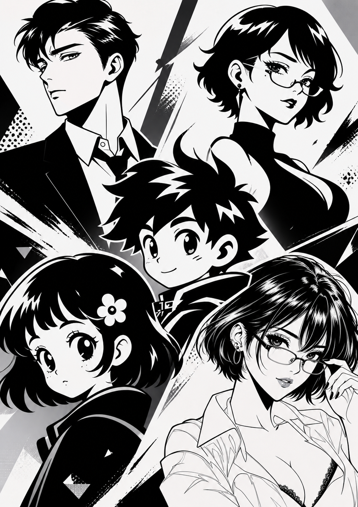

# Retro Manga Graphic Logo

A skill for creating original character logos in a high-contrast, retro
Japanese manga style.

## Features

- Pure black and white with extreme contrast
- Square 1:1 composition
- Bold, flat, and recognizable silhouettes
- Retro manga, screen-print, and linocut-inspired shapes
- Fully opaque white background with no transparency
- Clear readability at small icon sizes

## Use Cases

Create original character logos for people, mascots, animals, robots, and
other subjects. The skill avoids copying a reference character's identity,
face, hairstyle, clothing, pose, or composition.

See [SKILL.md](SKILL.md) for the complete instructions.
